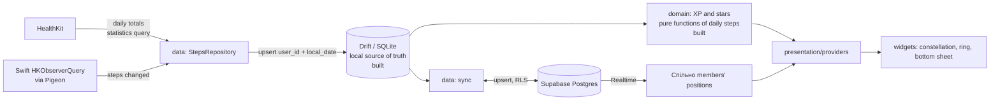

# Architecture

How Shlyakh is put together: what exists today, what is decided but not
built yet, and what is still open. Rules for agents are in
`docs/AGENT_RULES.md`; decisions with their trade-offs are in
`docs/decisions/`. When this document and the code disagree, the code is
right and this document needs an update in the same PR.

Status markers: **[built]** exists in `main`, **[decided]** agreed but not
implemented, **[open]** not decided yet.

## 1. Layers

```
lib/
├── main.dart             ProviderScope(child: App())
├── app/                  bootstrap: App, routerProvider, theme
├── core/                 shared utilities (l10n extension, clockProvider)
├── features/<feature>/
│   ├── domain/           pure Dart: entities, rules (XP, stars), repository interfaces
│   ├── data/             repository implementations, data sources
│   └── presentation/
│       ├── providers/    Riverpod providers and notifiers (state, derived values)
│       └── …             widgets and screens (render only)
└── l10n/                 ARB files (en template, uk)
ios/Runner/               native Swift (HealthKit background delivery)
tool/                     developer tooling (coverage check)
```

Dependency rule:

```
presentation ──► domain ◄── data
      │                       │
      └──► core ◄─────────────┘
```

- `domain` depends on nothing but Dart and `package:clock`'s `Clock` type
  (no Flutter, no platform packages). It defines repository interfaces;
  `data` implements them.
- `presentation` reads domain logic through providers. Widgets contain no
  business logic.
- `app` wires everything together and is the only place that knows every
  feature.

## 2. Current state [built]

```
main.dart ── ProviderContainer (logger, error handlers, StepsEventsHandler)
               └── UncontrolledProviderScope
                     └── App (MaterialApp.router, theme, l10n delegates)
                           └── routerProvider (go_router, redirect on the journey start)
                                 ├── /               LaunchScreen (the sky while the start loads; the failure if it fails)
                                 ├── /health-access  HealthAccessScreen (until the journey starts)
                                 └── AppShell (tabs + FloatingTabBar)
                                       ├── /today   TodayScreen
                                       ├── /path    PathScreen (constellation pages)
                                       │     └── map  PathMapScreen (the Milky Way map)
                                       └── /history HistoryScreen (placeholder)
```

- Path tab: `features/path/presentation/`. `pathProvider` (the route,
  the progress, one `PathPageView` per page with its figure states and
  completion date, the completed count and the ETA) feeds `PathScreen`,
  a `PageView` of `ConstellationPage`s (header, `ConstellationFigure`
  with a gold `done` style, `PathInfoCard`, `RouteStrip`), and
  `PathMapScreen` (`/path/map`), a scrolling `SkyMapPainter` chart.
  Both share `paintFigure` with Today.
- Today screen: `features/today/presentation/`. `todayProvider` (today's
  steps, XP, approximate distance, the week, star progress, the current
  `Constellation` and its `figureStates` from `routeProvider` and
  `StepsRepository.watchDays`) and the theme's palette feed the zones:
  sky with its backdrop and grain, `HillsSilhouette`, the glass
  `TodayCard` with the current star's `ProgressRing`, the
  `ConstellationFigure` between the card and the collapsed sheet, and
  `ProgressSheet` (collapsed: the day's XP and the current star;
  expanded: today, the week, a link to Path; runs under the tab bar).
- Steps: `features/steps/domain/` holds `DailySteps`, `LocalDate`,
  `JourneyStart`, the sync rules and the `StepsRepository` and
  `JourneyRepository` interfaces; `DriftStepsRepository` and
  `DriftJourneyRepository` implement them and turn SQLite errors into
  `StorageFailure` (`core/database/storage_errors.dart`, ADR 0005).
- Health access and triggers: `features/steps/presentation/`. Until a
  journey start exists the router redirects to `/health-access`
  (`HealthAccessScreen`); "Allow" (`HealthAccess.allow`) shows the
  system prompt, then stores the start at the moment of the tap and runs
  the first sync. `syncTriggersProvider` syncs on launch and on return to
  the foreground; `StepsEventsHandler`, registered in `main.dart` before
  `runApp`, syncs on HealthKit background wakeups. All share the one
  keepAlive `stepsSyncProvider`. `healthAccessHintProvider` shows a hint
  on Today a day after the start with no steps (ADR 0008).
  `currentDateProvider` is today's local date and changes at local
  midnight; `todayProvider` and `pathProvider` watch it, so an open app
  moves to the new day without new steps.

- Navigation: `routerProvider` (keepAlive) returns a `GoRouter`, so the
  router can later depend on auth state and be overridden in tests.
- Time: `clockProvider` is the only source of "now" (ADR 0002).
- Domain: `features/progress/domain/` holds the XP rules (`dailyXp`,
  `totalXp`). `features/path/domain/` holds the constellation path:
  `SkyRoute` and `Constellation` (`sky_route.dart`; validated, a shared star
  lights once in the first constellation that has it), `starCost`,
  `xpToLight` and `pathProgress` (`star_cost.dart`), `daysToNextStar`
  (`eta.dart`, the pace of the last 14 full days) and `starMoment`
  (`star_moment.dart`), `figureStates` / `figureStatesFor`
  (`figure_state.dart`: lit, current and ahead stars and solid lines of
  any constellation), `pathPages` (`path_pages.dart`: done, current and
  the next page), `completionDates` (`completion_dates.dart`, from the
  days) and `skyMapLayout` / `galacticEquator` (`sky_map.dart`: the
  chart geometry). Pure Dart, no Flutter.
- Design tokens: `core/design/` (`AppPalette`, a light and a dark
  palette as a `ThemeExtension`; member colours, Geologica typography,
  spacing, radii, glass, motion). `app/theme.dart` builds a light and a
  dark `ThemeData` from them; `App` follows the system appearance
  (`ThemeMode.system`).
- Sky data: `assets/sky/route.json`, built by `tool/sky/build_route.dart`
  from d3-celestial at a pinned commit (ADR 0009): the 16 route
  constellations (13 main, 3 on the branch) with HIP ids, magnitudes,
  J2000 positions and positions projected to a unit box (north up, east
  left), figure lines, a lighting order that always steps along a line,
  and each constellation's centre and angular span on the sky.
  `features/path/data/route_asset.dart` parses it into a `SkyRoute`;
  `routeProvider` (keepAlive) loads it once. The sky-data licences are on
  the licences page.
- Local storage: `core/database/app_database.dart` (Drift, schema v2,
  snapshots, steps and migration tests in `drift_schemas/`,
  `app_database.steps.dart` and `test/drift/`) with the `daily_steps` table
  (`user_id`, `local_date` `YYYY-MM-DD`, IANA `timezone`, `steps`; key
  `(user_id, local_date)`; STRICT; CHECKs on steps, date format and
  non-empty ids) and `DailyStepsDao` in
  `features/steps/data/local/`. Upsert replaces, HealthKit being the
  source of truth. Schema v2 adds `journey_start` (`user_id` key, UTC
  `started_at`, IANA `timezone`; one row per user, never overwritten)
  with `JourneyStartDao`.
- Steps sync: `features/steps/data/sync/steps_sync.dart` — `StepsSync`
  runs one sync at a time (a burst of calls gives at most two runs):
  from the journey start on the first sync, then the last 7 days, or
  from the last stored day after a longer gap (`syncFrom`); `mergeDays` in `domain/sync_rules.dart` writes new and
  changed days and keeps days counted in another time zone. Failures are
  logged, never thrown (`StepsSyncCompleted` on success); SQLite errors,
  also wrapped in `DriftRemoteException` by the background isolate,
  become `StorageFailure` (`guardStorage`).
- Constellation names: `features/path/presentation/providers/constellation_name.dart`
  maps an IAU id to its ARB string (uk, en).
- Localization: gen-l10n, `en` template and fallback, `uk` translation,
  `CFBundleLocalizations` for the iOS per-app language (ADR 0004).
- Native: `ios/Runner/Steps/` holds the HealthKit layer behind Pigeon
  (`pigeons/steps_api.dart`): `StepsHost` (`StepsHostApi`: availability,
  access prompt, daily totals from any start instant, time zone),
  `StepsObserver` (registered in `didFinishLaunching`, hourly background
  delivery) and `StepsEventsRelay` (HealthKit's completion only after
  Dart's `onStepsChanged` replies, or after 20 s). Pure helpers
  (`StepsDays`, `OnceCompletion`) have XCTest in `RunnerTests`, run
  locally only (CI is Linux). `HealthKitStepsSource` in
  `features/steps/data/healthkit/` wraps the host API and maps its error
  codes to failures; `StepsSync` and `HealthAccess` use it.

## 3. Target data flow [decided]



Invariants the flow must keep (details in `docs/AGENT_RULES.md`):

- **Steps come from HealthKit only** and are never edited in the app (6).
- **A day is the user's local calendar day**, stored as
  `(user_id, local_date, timezone)` (4).
- **XP is recomputed from daily steps**, never stored as a counter
  (CLAUDE.md, Rules).
- **Drift is the source of truth; the app works offline.** Supabase is a
  sync target (6).
- **Sync is idempotent**: upsert on `(user_id, local_date)` (6).
- **Health data is never logged** (5).

## 4. HealthKit integration

Decided by the stage 1 spike (ADR 0007):

- **[built]** Daily totals come from a native `HKStatisticsCollectionQuery`
  (cumulative sum, daily intervals anchored at local midnight,
  `.strictStartDate`) through Pigeon; the `health` plugin is not used. HealthKit deduplicates iPhone and Apple Watch by
  source priority; the result matches the Health app exactly, including
  truncated fractional steps. Summing raw samples double counts and is
  not allowed. The app does no deduplication of its own.
- **[built]** Background delivery: `HKObserverQuery` registered in
  `didFinishLaunching` and again after the access prompt,
  `enableBackgroundDelivery` at `.hourly`, `onStepsChanged` to Dart
  through Pigeon.
- **[built]** Native errors reach Dart as codes only, never messages:
  `unavailable` → `HealthUnavailable`, `locked` (device locked) →
  `HealthDataLocked`, `healthkit` (with HealthKit's code) →
  `UnexpectedFailure`; an undocumented code is a bug and is rethrown.
- **[built]** Entitlements: `com.apple.developer.healthkit` and
  `…healthkit.background-delivery`. Not `…healthkit.access` (health
  records), which a Personal Team cannot sign.
- **[decided]** iOS wakes the app in the background about once an hour
  while new steps arrive, and not at all while none do. Data refreshes on
  app launch, on return to the foreground and on an observer callback;
  other members' steps can be up to about an hour old.
- **[built]** Dart runs in a HealthKit background relaunch (ADR 0008):
  `FlutterImplicitEngineDelegate` creates the engine without a scene,
  the wakeup sent before Dart registers its handler is buffered by the
  channel, and a sync takes tens of milliseconds. The app does not need
  `UIBackgroundModes` and is not listed under Background App Refresh;
  whether the system-wide switch or Low Power Mode stops the wakeups is
  not verified.

## 5. Cross-cutting concerns

| Concern | Approach | Status |
|---|---|---|
| Dependency injection | Riverpod (`riverpod_generator`); `ProviderScope` at the root, overrides in tests | [built] |
| Time | `Clock` injected (constructor in domain, `clockProvider` in UI) | [built] |
| Localization | gen-l10n, every user-facing string in ARB | [built] |
| Navigation | go_router behind `routerProvider` | [built] |
| Models | freezed + json_serializable | [decided] |
| Local storage | Drift: one `AppDatabase` in `core/database/`, tables per feature, migrations from schema v1 | [built] |
| Backend | Supabase: auth, Postgres with RLS on every table, Realtime | [decided] |
| Design tokens | `lib/core/design/`: light and dark palettes, member colours, Geologica type scale, spacing, radii, matte glass, motion (`docs/DESIGN.md`) | [built] |
| Error handling | sealed `Failure` thrown by repositories, `AsyncValue.error`, `failureMessage` in the UI; unhandled errors to the logger (ADR 0005) | [built] |
| Logging | `AppLogger` with typed `LogEvent`s only; failures and errors by type, never by message; debug builds only (ADR 0006) | [built] |

## 6. Quality gates [built]

CI (`.github/workflows/ci.yml`) on every PR to `main`; merging requires it
to pass (branch protection, admins included):

1. `dart format --output=none --set-exit-if-changed .`
2. `dart analyze --fatal-infos` (includes `riverpod_lint`; `flutter analyze`
   would skip it)
3. `flutter test --coverage`
4. `dart run tool/coverage/check_coverage.dart`: domain 100%, data and
   `presentation/providers/` ≥ 85%, overall ≥ 85%; a measured file with
   code that no test loads fails the check

Generated files are not committed and are regenerated by
`flutter pub get` (l10n) and build_runner (ADR 0001).

## 7. Decisions

| ADR | Decision |
|---|---|
| [0001](decisions/0001-generated-files-not-committed.md) | Generated files are not committed (Pigeon Swift output is) |
| [0002](decisions/0002-explicit-clock-injection.md) | Explicit clock injection |
| [0003](decisions/0003-material-app-base.md) | `MaterialApp.router` as the app root |
| [0004](decisions/0004-localization-en-template-fallback.md) | English template and fallback |
| [0005](decisions/0005-error-handling.md) | Exceptions and a sealed `Failure` |
| [0006](decisions/0006-logging.md) | Typed log events, never messages |
| [0007](decisions/0007-healthkit-steps-and-background-delivery.md) | HealthKit daily totals and hourly background delivery |
| [0008](decisions/0008-steps-sync.md) | Journey start, 7-day window with gap fill, zone rule, background runs |
| [0009](decisions/0009-sky-data.md) | Sky data from d3-celestial (BSD-3) at a pinned commit, built into a committed asset |

## 8. Open questions

- Спільно model (groups, invitations, membership, who sees whose steps):
  backend design in stage 5. The local schema keys everything by `user_id`
  and assumes no fixed number of users.
- Background wake-up frequency (section 4) and the resulting sync
  schedule.
- The main app and the spike share the bundle id
  `com.denyskorotin.shlyakh`: while the spike build is on the iPhone, the
  main app is tested on the simulator only.
