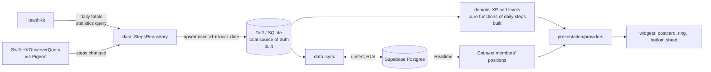

# Architecture

How Shlyakh is put together: what exists today, what is decided but not
built yet, and what is still open. Rules for agents are in
`docs/AGENT_RULES.md`; decisions with their trade-offs are in
`docs/decisions/`. When this document and the code disagree, the code is
right and this document needs an update in the same PR.

Status markers: **[built]** exists in `main`, **[decided]** agreed but not
implemented, **[open]** not decided yet.

## 1. Layers

```
lib/
├── main.dart             ProviderScope(child: App())
├── app/                  bootstrap: App, routerProvider, theme
├── core/                 shared utilities (l10n extension, clockProvider)
├── features/<feature>/
│   ├── domain/           pure Dart: entities, rules (XP, levels), repository interfaces
│   ├── data/             repository implementations, data sources
│   └── presentation/
│       ├── providers/    Riverpod providers and notifiers (state, derived values)
│       └── …             widgets and screens (render only)
└── l10n/                 ARB files (en template, uk)
ios/Runner/               native Swift (HealthKit background delivery)
tool/                     developer tooling (coverage check)
```

Dependency rule:

```
presentation ──► domain ◄── data
      │                       │
      └──► core ◄─────────────┘
```

- `domain` depends on nothing but Dart and `package:clock`'s `Clock` type
  (no Flutter, no platform packages). It defines repository interfaces;
  `data` implements them.
- `presentation` reads domain logic through providers. Widgets contain no
  business logic.
- `app` wires everything together and is the only place that knows every
  feature.

## 2. Current state [built]

```
main.dart ── ProviderScope
               └── App (MaterialApp.router, theme, l10n delegates)
                     └── routerProvider (go_router, route '/')
                           └── HomeScreen (placeholder: localized title)
```

- Navigation: `routerProvider` (keepAlive) returns a `GoRouter`, so the
  router can later depend on auth state and be overridden in tests.
- Time: `clockProvider` is the only source of "now" (ADR 0002).
- Domain: `features/progress/domain/` holds the XP rules (`dailyXp`,
  `totalXp`) and the level curve (`xpToReachLevel`, `levelProgress`), pure
  functions with 100% test coverage. Nothing reads real steps yet.
- Design tokens: `core/design/` (sky keyframes and `skyAt`, Oklab/OkLCh
  blending, NOAA sun times, member colours, Geologica typography, spacing,
  radii, glass, motion); `app/theme.dart` is built from them.
- Local storage: `core/database/app_database.dart` (Drift, schema v1,
  snapshot in `drift_schemas/`) with the `daily_steps` table
  (`user_id`, `local_date` `YYYY-MM-DD`, IANA `timezone`, `steps`; key
  `(user_id, local_date)`; STRICT; CHECKs on steps, date format and
  non-empty ids) and `DailyStepsDao` in
  `features/steps/data/local/`. Upsert replaces, HealthKit being the
  source of truth. Nothing writes to it yet.
- Level titles: `features/progress/domain/level_titles.dart` (chapters,
  continuation degree, `GrammaticalGender`) and
  `presentation/providers/level_title.dart` (maps a level to its ARB string;
  `grammaticalGenderProvider`).
- Localization: gen-l10n, `en` template and fallback, `uk` translation,
  `CFBundleLocalizations` for the iOS per-app language (ADR 0004).
- Native: `AppDelegate` is the Flutter template; no native code in `main`
  yet. The HealthKit probe lives only on the throwaway `spike/healthkit`
  branch.

## 3. Target data flow [decided]



Invariants the flow must keep (details in `docs/AGENT_RULES.md`):

- **Steps come from HealthKit only** and are never edited in the app (6).
- **A day is the user's local calendar day**, stored as
  `(user_id, local_date, timezone)` (4).
- **XP is recomputed from daily steps**, never stored as a counter
  (CLAUDE.md, Rules).
- **Drift is the source of truth; the app works offline.** Supabase is a
  sync target (6).
- **Sync is idempotent**: upsert on `(user_id, local_date)` (6).
- **Health data is never logged** (5).

## 4. HealthKit integration

Decided by the stage 1 spike (ADR 0007):

- **[decided]** Daily totals come from a statistics query
  (`health` plugin `getTotalStepsInInterval`, i.e. `HKStatisticsQuery`
  with cumulative sum). HealthKit deduplicates iPhone and Apple Watch by
  source priority; the result matches the Health app exactly, including
  truncated fractional steps. Summing raw samples double counts and is
  not allowed. The app does no deduplication of its own.
- **[decided]** Background delivery needs native Swift: `HKObserverQuery`
  registered in `didFinishLaunching`, `enableBackgroundDelivery`, exposed to
  Dart through Pigeon. The `health` plugin has no API for it.
- **[decided]** Entitlements: `com.apple.developer.healthkit` and
  `…healthkit.background-delivery`. Not `…healthkit.access` (health
  records), which a Personal Team cannot sign.
- **[decided]** iOS wakes the app in the background about once an hour
  while new steps arrive, and not at all while none do. Data refreshes on
  app launch, on return to the foreground and on an observer callback;
  other members' steps can be up to about an hour old.
- **[open]** Whether Dart gets enough time in a background wakeup to read
  HealthKit and write to Drift; checked when the sync is built.

## 5. Cross-cutting concerns

| Concern | Approach | Status |
|---|---|---|
| Dependency injection | Riverpod (`riverpod_generator`); `ProviderScope` at the root, overrides in tests | [built] |
| Time | `Clock` injected (constructor in domain, `clockProvider` in UI) | [built] |
| Localization | gen-l10n, every user-facing string in ARB | [built] |
| Navigation | go_router behind `routerProvider` | [built] |
| Models | freezed + json_serializable | [decided] |
| Local storage | Drift: one `AppDatabase` in `core/database/`, tables per feature, migrations from schema v1 | [built] |
| Backend | Supabase: auth, Postgres with RLS on every table, Realtime | [decided] |
| Design tokens | `lib/core/design/`: time-of-day sky, member colours, Geologica type scale, spacing, radii, matte glass, motion (`docs/DESIGN.md`) | [built] |
| Error handling | sealed `Failure` thrown by repositories, `AsyncValue.error`, `failureMessage` in the UI; unhandled errors to the logger (ADR 0005) | [built] |
| Logging | `AppLogger` with typed `LogEvent`s only; failures and errors by type, never by message; debug builds only (ADR 0006) | [built] |

## 6. Quality gates [built]

CI (`.github/workflows/ci.yml`) on every PR to `main`; merging requires it
to pass (branch protection, admins included):

1. `dart format --output=none --set-exit-if-changed .`
2. `dart analyze --fatal-infos` (includes `riverpod_lint`; `flutter analyze`
   would skip it)
3. `flutter test --coverage`
4. `dart run tool/coverage/check_coverage.dart`: domain 100%, data and
   `presentation/providers/` ≥ 85%, overall ≥ 85%; a measured file with
   code that no test loads fails the check

Generated files are not committed and are regenerated by
`flutter pub get` (l10n) and build_runner (ADR 0001).

## 7. Decisions

| ADR | Decision |
|---|---|
| [0001](decisions/0001-generated-files-not-committed.md) | Generated files are not committed (Pigeon Swift output is) |
| [0002](decisions/0002-explicit-clock-injection.md) | Explicit clock injection |
| [0003](decisions/0003-material-app-base.md) | `MaterialApp.router` as the app root |
| [0004](decisions/0004-localization-en-template-fallback.md) | English template and fallback |
| [0005](decisions/0005-error-handling.md) | Exceptions and a sealed `Failure` |
| [0006](decisions/0006-logging.md) | Typed log events, never messages |
| [0007](decisions/0007-healthkit-steps-and-background-delivery.md) | HealthKit daily totals and hourly background delivery |

## 8. Open questions

- Спільно model (groups, invitations, membership, who sees whose steps):
  backend design in stage 5. The local schema keys everything by `user_id`
  and assumes no fixed number of users.
- Background wake-up frequency (section 4) and the resulting sync
  schedule.
- Where the grammatical gender is stored before registration exists
  (`grammaticalGenderProvider` defaults to masculine for now).
- What the dot's position on the landscape represents (`docs/PRODUCT.md`).
- The main app and the spike share the bundle id
  `com.denyskorotin.shlyakh`: while the spike build is on the iPhone, the
  main app is tested on the simulator only.
